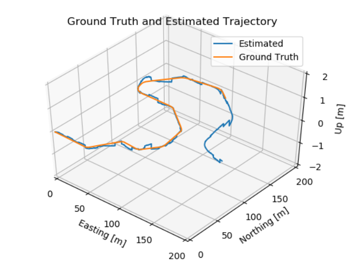
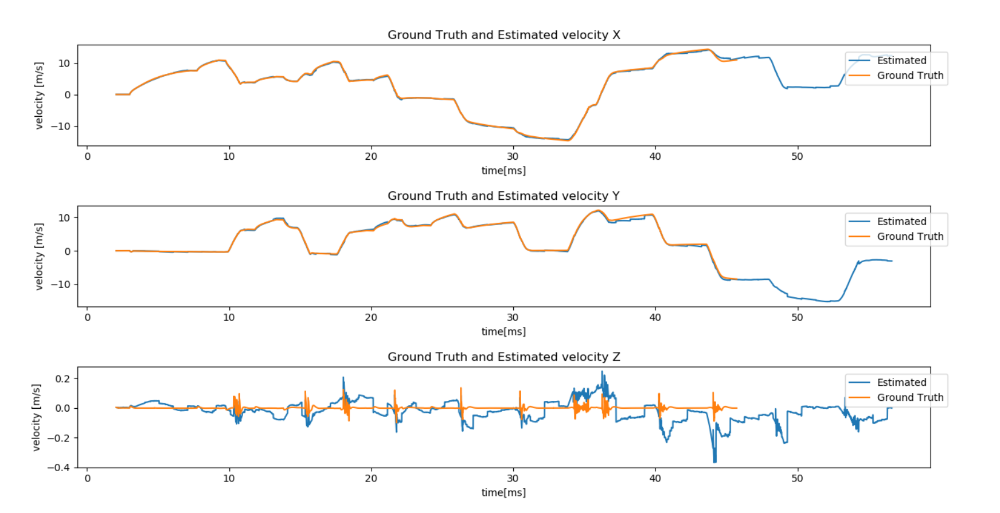
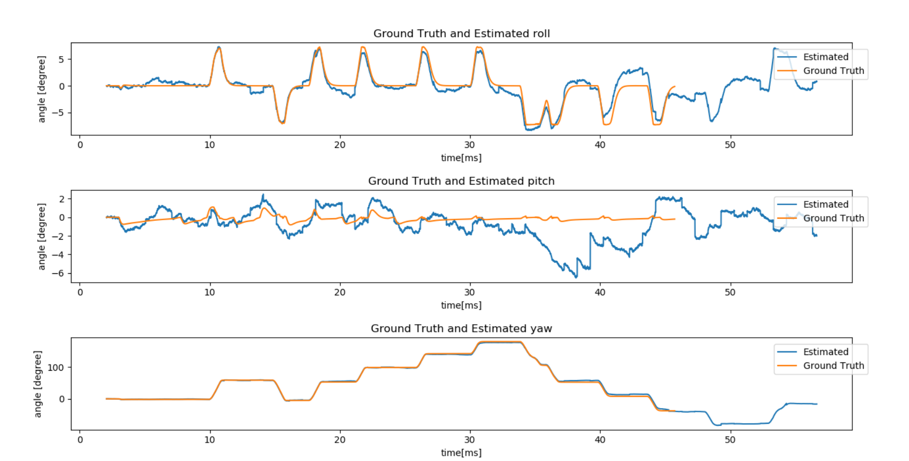

# Quaternion Kinematic for the error-state extended kalman filter(ES-EKF)

## The implementation the methods introduced in the paper of Quaternion Kinematic for the error-state kalman filter

### Result

Position Estimation Compared with Ground Truth

Velocity Estimation Compared with Ground Truth

Attitude and Heading Estimation Compared with Ground Truth

